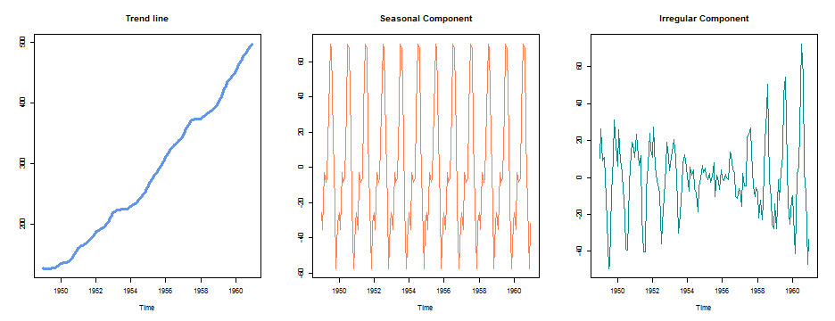
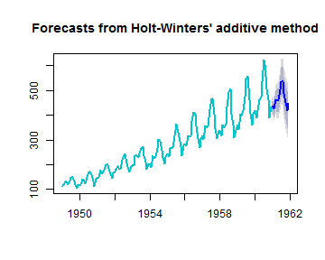

## Description

We explore simple time series decomposition and forecasting. The chief features of the app

  * We use `dygraphs` package for interactive charting 
  * An example of time series decomposition using `loess`
  * Forecasting of time series using `Holt-Winters Filtering`

The app is running [shiny server](https://abysmon.shinyapps.io/AirPassenger/).
Sourcecode is on [github](https://github.com/abysmon/devDataProd/).

--- .class #id 

## What is it about

`AirPassengers` is contains monthly international airline passengers, in thousands, from 1949 to 1960. 

Summary

```
   Min. 1st Qu.  Median    Mean 3rd Qu.    Max. 
  104.0   180.0   265.5   280.3   360.5   622.0 
```

 


--- .class #id 

## What do we do

We split the dataset into seasonal component and the trend line

 

--- .class #id 

## What do we do (contd..)
Then we forecast it from upto 60 months ahead with two user controlled input
  *  Forecast ahead months
  *  Prediction bounds

**The predicted data and measured data are shown below**
 


